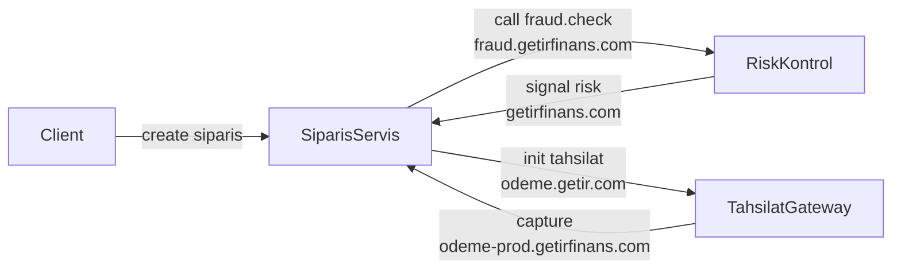

# Architecture

Üç servisli bir akış:

```
siparis-api.getirfinans.com -> odeme.getir.com (tahsilat) -> fraud.getirfinans.com
```



Ek sinyal: README, config ve env örnekleri getir.com / getirfinans.com anahtar kelimelerini içerir.

